<div align="center">
  
</div>

<div align="center">
  <samp>ACCESS GRANTED &nbsp;·&nbsp; PROFILE ID: SHRUTISHAHI18 &nbsp;·&nbsp; BUILD CHANNEL: PUBLIC</samp>
</div>

<br />

<div align="center">
  <a href="https://github.com/ShrutiShahi18">GITHUB</a>
  &nbsp;&nbsp;·&nbsp;&nbsp;
  <a href="linkedin.com/in/shruti-shahi180803/">LINKEDIN</a>
  &nbsp;&nbsp;·&nbsp;&nbsp;
  <a href="mailto:yoshruti18@gmail.com">EMAIL</a>
</div>

<br />

## `root@shruti:~$ cat /about`

I build full-stack products with real authentication, persistent data, reliable
APIs, and production-minded workflows.

My work sits at the intersection of backend engineering, AI-powered products,
and developer experience. I care about what happens after the demo: failure
handling, test coverage, maintainable interfaces, and software another person
can actually run.

```text
┌─ SPECIALIZATION ────────────────────────────────────────────────────┐
│  Backend reliability   AI product systems   Developer tooling        │
├─ PRIMARY LOADOUT ───────────────────────────────────────────────────┤
│  React · TypeScript · Node.js · Python · C# · .NET                  │
│  MongoDB · MySQL · Firebase · REST APIs                              │
├─ OPERATING PRINCIPLE ───────────────────────────────────────────────┤
│  Understand the problem → design the system → ship the useful part  │
└─────────────────────────────────────────────────────────────────────┘
